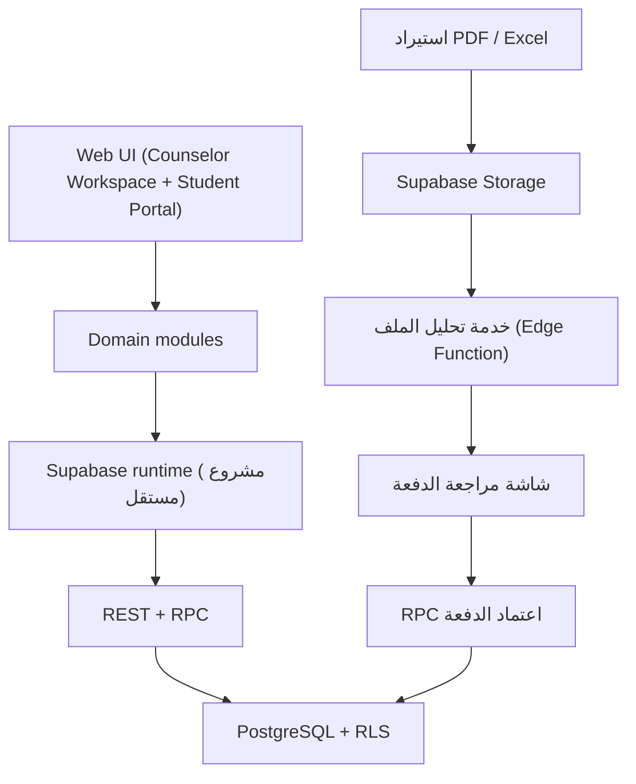
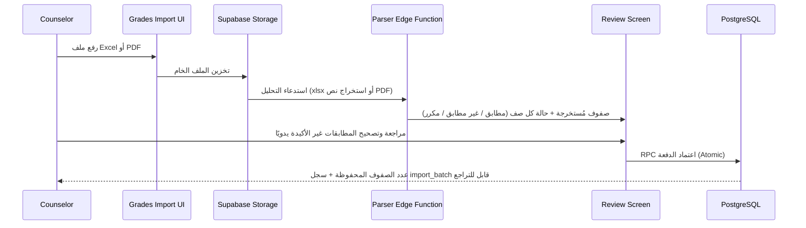

# معمارية رشاد

## نظرة عامة

تطبيق واجهة واحد يعمل بملفات HTML/CSS/JavaScript دون إطار عمل (بنفس أسلوب CCE StableOS)، ويستخدم مشروع Supabase **مستقل تمامًا** عن مشروع CCE للهوية وقاعدة البيانات وRPC وRLS والتخزين (Storage لملفات الاستيراد). لا توجد أي مشاركة بيانات أو مفاتيح بين المشروعين.

بخلاف CCE (الذي بدأ بملف `app-core.js` ضخم ثم انتقل تدريجيًا إلى وحدات)، يبدأ رشاد مباشرة ببنية الوحدات (`src/modules/<domain>/<domain>-service.js` بلا DOM + Controller واجهة منفصل) تجنبًا للدَّين التقني نفسه من اليوم الأول.

## طبقات الواجهة

- `index.html`: هيكل الصفحات والبوابتين (مساحة عمل المرشد، بوابة الطالب) وتحميل الأصول.
- `src/styles/design-system.css`: رموز تصميم مستقلة عن لوحة ألوان CCE (لتفادي الالتباس البصري بين التطبيقين) لكن بنفس المبادئ (المسافات، نقاط التحول، الخط، الوصول).
- `src/components/header/`: ترويسة موحدة بنفس نمط قياس Safe Area في CCE.
- `src/core/`: `config.js` (إعداد Supabase)، `events.js` (ناقل أحداث موحّد)، `store.js` (حالة تطبيق خفيفة). لا حالة عالمية متكررة داخل كل وحدة.
- `src/modules/<domain>/<domain>-service.js`: منطق كل مجال (تحقق، CRUD، تصفح) بلا أي كود DOM — قابل للاختبار بمعزل عن الواجهة، بنفس نمط `src/modules/show-office/*-service.js` في CCE.
- `src/modules/<domain>/<domain>-ui.js`: طبقة العرض والتحكم في DOM لكل مجال، تستهلك الخدمة المقابلة فقط.
- `src/services/supabase-runtime.js`: تغليف عميل Supabase (نفس نمط CCE).
- `src/services/import-runtime.js`: تنسيق رفع الملف، استدعاء خدمة التحليل، وعرض نتيجة المعاينة.

## وحدات المجال (Domain Modules)

| الوحدة | الغرض | ملاحظات معمارية |
|---|---|---|
| `department-plan` | خطة القسم وأهدافها ومؤشراتها | CRUD بسيط، لا بيانات حساسة |
| `agenda` | الأجندة التنفيذية (الأنشطة والفعاليات) | يرتبط اختياريًا بهدف من `department-plan` |
| `reminders` | التذكيرات الشخصية للمرشد | يرتبط اختياريًا بطالب/نشاط/حالة/خطة دعم عبر مرجع عام (`entity_type` + `entity_id`) بدل مفاتيح خارجية متعددة |
| `students` | سجل الطلبة الأساسي | مصدر الحقيقة لهوية الطالب؛ بقية الوحدات تشير إليه بـ `student_id` فقط |
| `grades` | استيراد الدرجات وتخزينها | لا تُعدَّل الدرجة المستوردة يدويًا إلا بسجل تدقيق صريح (`grade_corrections`) |
| `grade-analytics` | التحليلات المشتقة من `grades` | Views/RPC للقراءة فقط؛ لا تخزّن نسخة مكررة من الدرجات |
| `guidance-cases` | الحالات الإرشادية وجلسات المتابعة | بيانات حساسة درجة أولى؛ RLS أضيق طبقة في النظام |
| `support-plans` | خطط الدعم الفردية وإجراءاتها | قد ترتبط بحالة إرشادية أو تُنشأ مباشرة من تحليلات الدرجات |
| `career-guidance` | جلسات وتوصيات التوجيه المهني | مستقلة عن `guidance-cases` (سياق مختلف: مستقبل الطالب لا مشكلة حالية) |
| `import` | محرك استيراد PDF/Excel المشترك | يُستخدم من `grades` وقد يُستخدم لاحقًا من `students` (استيراد كشف الطلبة) |

## بوابات النظام (الإصدار الأول)

- **Counselor Workspace**: لوحة المرشد الكاملة — كل الوحدات أعلاه.
- **Student Portal**: قراءة فقط لدرجات الطالب وخطة دعمه إن وُجدت، بالإضافة إلى نموذج طلب موعد يكتب في `reminders`/`guidance-cases` عبر RPC محروسة (الطالب لا يكتب مباشرة في الحالات الإرشادية).

التحكم في إظهار الواجهة حسب الدور لا يُعد حماية فعلية؛ الحماية الحقيقية تبقى في RLS وRPC داخل Supabase، بنفس مبدأ CCE.

## تدفق استيراد الدرجات (PDF / Excel)

نقطتان معماريتان أساسيتان:

1. **Excel هو المسار الأساسي والأدق** (قالب أعمدة ثابت: الرقم الأكاديمي، اسم الطالب، المادة، الفترة، الدرجة، الدرجة العظمى). التحليل عبر مكتبة قراءة XLSX من جانب المتصفح، بلا حاجة لخادم تحليل معقّد.
2. **PDF مسار ثانوي أقل دقة بطبيعته** لأن تقارير الدرجات تختلف تنسيقًا بين الأنظمة المدرسية. يُستخرج النص عبر مكتبة استخراج PDF، ثم محرك مطابقة أنماط (Regex/Heading detection) قابل للتهيئة حسب "قالب تقرير" مُسجَّل مسبقًا لكل نظام مصدر. **لا يوجد اعتماد تلقائي لصفوف PDF غامضة** — أي صف لا يُطابَق بثقة كافية يُعرض صراحة في شاشة المراجعة بدل تجاهله أو تخمينه.

فشل أي جزء من التحليل يوقف الدفعة كاملة عند شاشة المراجعة ولا يحفظ جزءًا منها صامتًا؛ الحفظ فعلي فقط بعد اعتماد المرشد الصريح عبر RPC واحدة تتحقق من كل الصفوف ثم تكتبها ذريًا (نفس نمط استعادة النسخ الاحتياطية في CCE).

## اتجاه التطوير

كل منطق أعمال جديد يعيش في خدمة مجال (`*-service.js`) بلا DOM من اليوم الأول. `store.js` وحدث موحّد (`events.js`) بدل تكرار الحالة العالمية بين الوحدات. سلسلة قاعدة البيانات تُختبر من مخطط فارغ في CI بنفس نمط `tests/supabase-chain.test.mjs` في CCE، مع اختبار قبول لاحق على مشروع Supabase تجريبي قبل أي إنتاج حقيقي.
