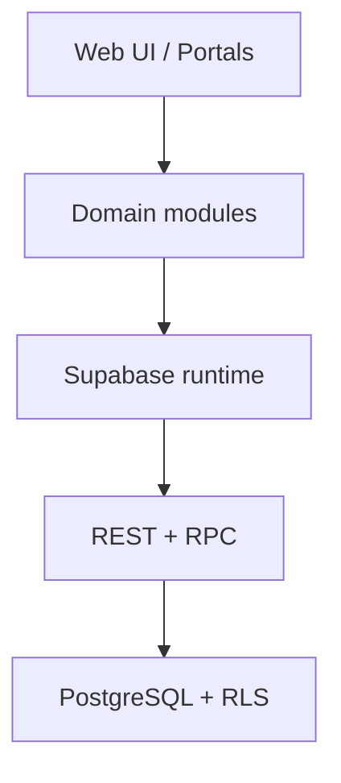
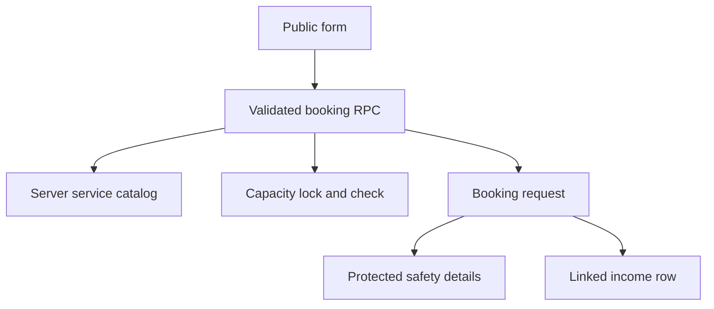
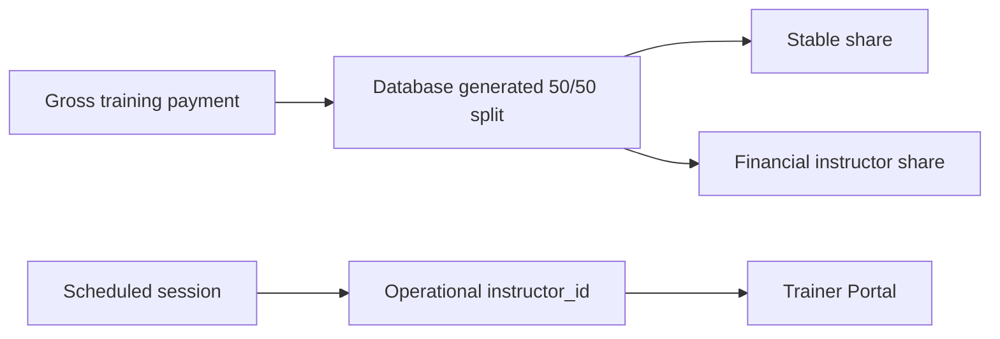
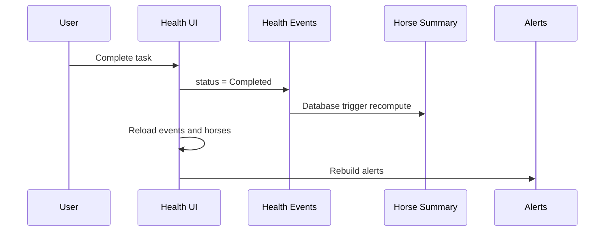

# معمارية CCE StableOS

## نظرة عامة

الإصدار 4.8.3 تطبيق واجهة موحد يعمل بملفات HTML/CSS/JavaScript ويستخدم Supabase للهوية وقاعدة البيانات وRPC وRLS. المعمارية انتقالية: ما زال `app-core.js` يحتوي على منطق قديم كبير، بينما تنتقل المجالات تدريجيًا إلى خدمات ووحدات تحت `src/`.

## طبقات الواجهة

- `index.html`: هيكل الصفحات والبوابات وتحميل الأصول.
- `app-core.css` و`member-portal.css`: الأنماط القديمة والبوابات.
- `src/styles/design-system.css`: رموز التصميم المشتركة.
- `src/components/header/`: الترويسات الموحدة وقياس موضع لوحة التنبيهات.
- `app-core.js`: التشغيل الحالي، الإدارة، المالية، الجداول والتنبيهات.
- `member-portal.js`: الجلسة الموحدة وRBAC والتحميل حسب الصلاحيات.
- `horse-health.js`: واجهة مجال صحة الخيل.
- `src/modules/health/health-service.js`: تحديدات ومثابرة مجال الصحة.

## البوابات والأدوار

- Public: الصفحة الرئيسية وطلبات الحجز والتدريب والإيواء.
- Dashboard: صفحات الإدارة والعمليات والمالية حسب الصلاحيات.
- Owner Portal: خيل المالك المرتبطة به فقط.
- Trainer Portal: جدول المدرب وتحديث الجلسات الخاصة به.

التحكم في إظهار الواجهة لا يُعد حماية. الحماية الفعلية يجب أن تبقى في RLS وRPC داخل Supabase.

## تدفق الحجز العام

لا تكتب النماذج العامة في جدول المالية مباشرة. ترسل الواجهة رمز الخدمة والبيانات المطلوبة إلى `cce_public_submit_booking`، وتقوم قاعدة البيانات داخل معاملة واحدة بما يلي:

1. التحقق من نوع الخدمة والسعر من `public_booking_services`.
2. التحقق من التاريخ والوقت وعدد حصص التدريب والموافقة على نسخة الشروط.
3. قفل تاريخ الحجز لمنع تجاوز السعة عند وصول طلبين متزامنين.
4. إنشاء `booking_requests` و`booking_private_details` وسجل `income` المربوط.
5. إعادة المبلغ والمرجع المقبولين من الخادم.

حالة الطلب (`Requested / Confirmed / Scheduled / Completed / Cancelled / Rejected`) منفصلة عن حالة الدفع (`Pending / Partial / Paid`). تغيير حالة الطلب يتم عبر `cce_update_booking_status` وليس بتعديل مفتوح من المتصفح.

## تدفق باقة التدريب والمدرب

الدفع والإسناد التشغيلي مساران مرتبطان بالمدرب لكنهما مستقلان:

1. عند تسجيل دفعة جديدة لبند `Lesson / Training`، يفعّل النظام `training_split_enabled` وتختار الإدارة المدرب المالي في `income.instructor_id`.
2. قاعدة البيانات تشتق فورًا حصة الإسطبل وحصة المدرب 50/50 من `paid_bd`، دون تغيير إجمالي العميل أو المتبقي.
3. عند إنشاء جلسة فعلية، تختار الإدارة المدرب التشغيلي في `schedule.instructor_id`.
4. يمكن إعادة إسناد الجلسة، فتظهر لمدربها الجديد في Trainer Portal بواسطة المعرّف لا تطابق الاسم.

يبقى الإيصال وكشف العميل مبنيين على `amount_bd` و`paid_bd`. أما لوحة الربح وتقارير الخدمات فتستخدم `stable_share_bd` حتى لا تعد حصة المدرب إيرادًا للإسطبل.

سجلات Lesson السابقة لحد القطع تبقى `training_split_enabled=false` لأن كثيرًا من مبالغها يمثل حصة الإسطبل أصلًا. لا يُطبق عليها أي أثر رجعي إلا عندما يفعّل المدير سجلًا محددًا صراحةً.

## تصنيف البيانات

- بيانات التشغيل العامة للموظف المخول: الاسم، الهاتف، الخدمة، التاريخ والحالة في `booking_requests`.
- بيانات السلامة المحمية: الرقم الشخصي، تاريخ الميلاد، جهة الطوارئ والملاحظات الصحية في `booking_private_details`.
- البيانات المالية: المبلغ والحالة المالية والمرجع فقط في `income`، دون نسخ بيانات الهوية أو الصحة إلى الملاحظات.
- قراءة بيانات السلامة تحتاج `bookings.sensitive.view` وتُسجل في `audit_logs`.

## نموذج صحة الخيل

- `horses.status`: حالة تشغيلية مثل Available وOut وSold وDead.
- `horse_health_profiles.health_status`: حالة صحية مثل Healthy وInjured وCritical.
- `horse_health_events`: السجل الزمني الأساسي للفحوص والتطعيمات ومهام العناية.
- أعمدة مثل `horses.farrier_date`: ملخصات توافقية للواجهات القديمة، وليست مصدر الحقيقة.

عند إضافة حدث مدعوم أو تعديله أو حذفه، يعيد v4.7.0 احتساب الملخص التوافقي من أحدث حدث مكتمل. لذلك فإن إلغاء أحدث حدث أو حذفه يعيد القيمة السابقة الصحيحة بدل إبقاء ملخص قديم. وتشتق الواجهة الملخص من الأحداث أيضًا لحماية تجربة المستخدم من البيانات القديمة أو تأخر التحديث.

## تدفق التحديث الصحي

## اتجاه التطوير

يجب نقل المنطق الجديد إلى خدمات مجال صغيرة، إبقاء DOM خارج طبقة البيانات، واستخدام حدث موحد أو Store بدل تكرار الحالة العالمية. أي تفكيك لـ`app-core.js` ينفذ تدريجيًا مع اختبارات تمنع تغيير السلوك. سلسلة قاعدة البيانات تُختبر الآن من مخطط فارغ داخل `tests/supabase-chain.test.mjs`، لكن اختبار القبول على مشروع Supabase تجريبي حقيقي يظل مطلوبًا قبل الإنتاج.
