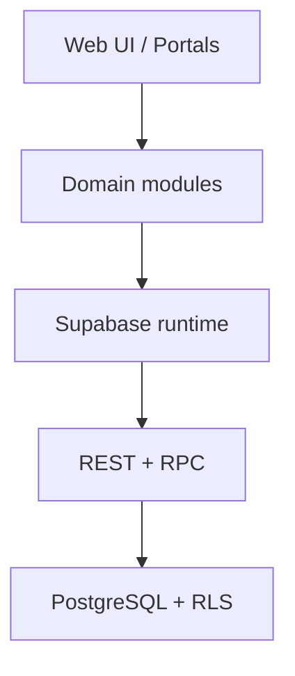
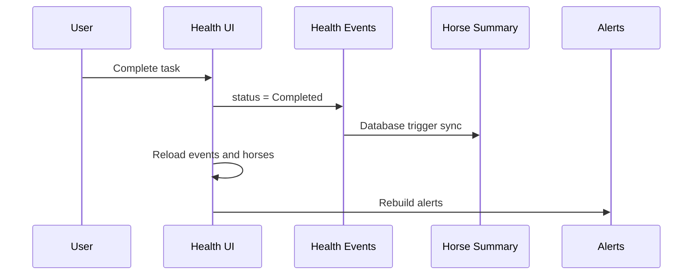

# معمارية CCE StableOS

## نظرة عامة

الإصدار الحالي تطبيق واجهة موحد يعمل بملفات HTML/CSS/JavaScript ويستخدم Supabase للهوية وقاعدة البيانات وRPC وRLS. المعمارية انتقالية: ما زال `app-core.js` يحتوي على منطق قديم كبير، بينما تنتقل المجالات تدريجيًا إلى خدمات ووحدات تحت `src/`.

## طبقات الواجهة

- `index.html`: هيكل الصفحات والبوابات وتحميل الأصول.
- `app-core.css` و`member-portal.css`: الأنماط القديمة والبوابات.
- `src/styles/design-system.css`: رموز التصميم المشتركة.
- `src/components/header/`: الترويسات الموحدة وقياس موضع لوحة التنبيهات.
- `app-core.js`: التشغيل الحالي، الإدارة، المالية، الجداول والتنبيهات.
- `member-portal.js`: الجلسة الموحدة وRBAC والتحميل حسب الصلاحيات.
- `horse-health.js`: واجهة مجال صحة الخيل.
- `src/modules/health/health-service.js`: تحديدات ومثابرة مجال الصحة.

## البوابات والأدوار

- Public: الصفحة الرئيسية وطلبات الحجز والتدريب والإيواء.
- Dashboard: صفحات الإدارة والعمليات والمالية حسب الصلاحيات.
- Owner Portal: خيل المالك المرتبطة به فقط.
- Trainer Portal: جدول المدرب وتحديث الجلسات الخاصة به.

التحكم في إظهار الواجهة لا يُعد حماية. الحماية الفعلية يجب أن تبقى في RLS وRPC داخل Supabase.

## نموذج صحة الخيل

- `horses.status`: حالة تشغيلية مثل Available وOut وSold وDead.
- `horse_health_profiles.health_status`: حالة صحية مثل Healthy وInjured وCritical.
- `horse_health_events`: السجل الزمني الأساسي للفحوص والتطعيمات ومهام العناية.
- أعمدة مثل `horses.farrier_date`: ملخصات توافقية للواجهات القديمة، وليست مصدر الحقيقة.

عند إكمال حدث مدعوم، يقوم ترحيل v4.6.4 بتحديث الملخص التوافقي. وتشتق الواجهة الملخص من الأحداث أيضًا لحماية تجربة المستخدم من البيانات القديمة أو تأخر التحديث.

## تدفق التحديث الصحي

## اتجاه التطوير

يجب نقل المنطق الجديد إلى خدمات مجال صغيرة، إبقاء DOM خارج طبقة البيانات، واستخدام حدث موحد أو Store بدل تكرار الحالة العالمية. أي تفكيك لـ`app-core.js` ينفذ تدريجيًا مع اختبارات تمنع تغيير السلوك.
